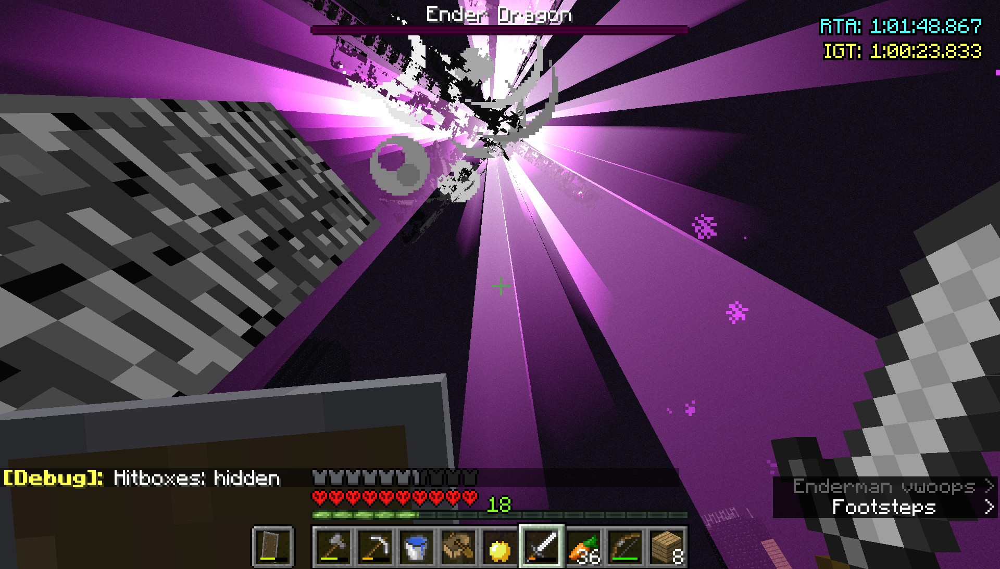

# Give me a heart !

A Legacy Fabric mod for Minecraft 1.11.2 that features a twist to health regeneration.

###  Changes : 

- Eating any kind of food gives you an additional heart.
- No hunger bar (and you can always sprint).
- Eating is almost instantaneous.
- Your max health is always equal to your health, so the only way to regenerate health is through eating food or getting absorption.

and health is capped at 10 hearts as usual (excluding absorption hearts which can still be stacked).

This is mainly intended to be used within challenges and not really for long term survival ventures, but you can do whatever you want ! It's a sandbox game :)

### Retrospective :

After trying it out for some time, it definitely made the game a bit more fun in some way! 
You spend less time eating, but more time gathering food, which does actually make food less annoying in general.

I was hoping it would make the game  a bit more challenging in a non-annoying way but ended up making it a bit easier but still non-annoying. This remains a fun experiment nonetheless!

I'd suggest trying it out !

My personal best in 1.11.2 with this mod as of writing this is 1:00:28.238.

GitHub should have a comments section... :v